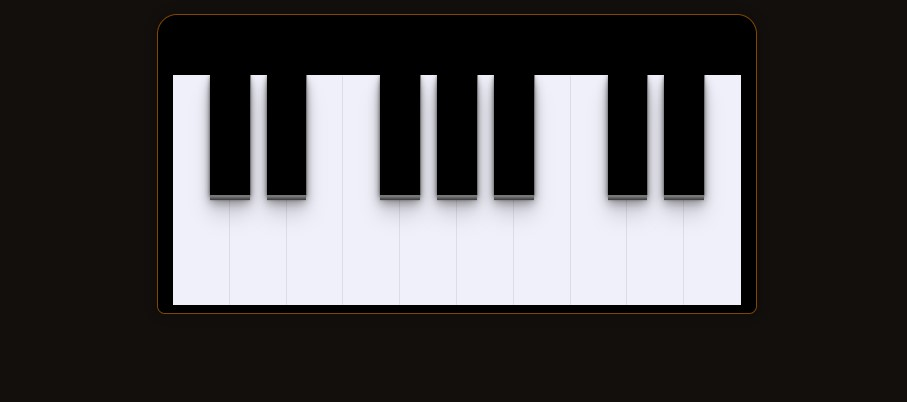

<h1 align="center">
  Dom manipulation with pure javascript
</h1>

<p align="center">
  <a href="#rocket-project">Project</a>&nbsp;&nbsp;&nbsp;|&nbsp;&nbsp;&nbsp;
  <a href="#computer-technologies">Technologies</a>&nbsp;&nbsp;&nbsp;|&nbsp;&nbsp;&nbsp;
  <a href="#thinking-how-to-use">How to use?</a>&nbsp;&nbsp;&nbsp;|&nbsp;&nbsp;&nbsp;
  <a href="#memo-license">License</a>
</p>

## :rocket: Project

:globe_with_meridians: 
Project developed to study dom manipulation

## Preview

<div style="display: flex">

</div>

## :computer: Technologies
- [HTML](https://developer.mozilla.org/pt-BR/docs/Web/HTML)
- [CSS](https://developer.mozilla.org/pt-BR/docs/Web/CSS)
- [javascript](https://developer.mozilla.org/pt-BR/docs/Web/JavaScript)

## :thinking: How to use?

```sh
open index.html
```

## :memo: License

MIT
